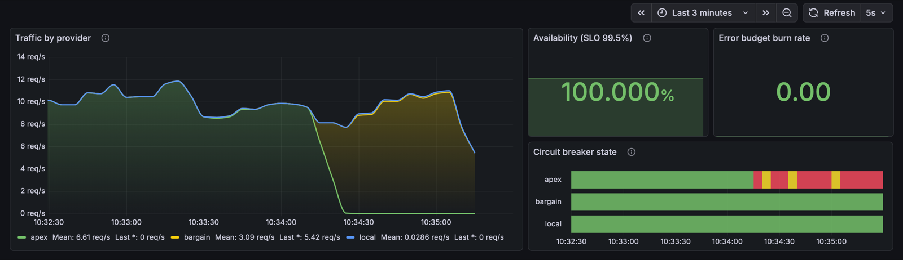

# Switchyard

[](https://github.com/bezilla/switchyard/actions/workflows/ci.yml)

An AI provider gateway that routes inference across simulated providers and
visibly survives their failures. The simulation is the point: you cannot
reproducibly break someone else's API, and reproducible failure is what makes
breaker behavior demonstrable rather than asserted.

The thesis: **AI infrastructure's production problems are the old problems in
new vocabulary.** Routing, failover, rate limits, quotas, cost, observability —
the concerns CDNs and load balancers settled two decades ago, wearing different
words. Switchyard is that argument as running code.

## The result

`apex` — the fastest and most expensive of three simulated providers — taken
down hard, mid-traffic, with a load generator running:

| | |
|---|---|
| **Failovers** | 290 |
| **Requests dropped** | 0 |
| **Availability held** | 100% |
| **Error budget burned** | 0.00× |

One run of `make e2e`, which asserts these from parsed Prometheus metrics rather
than from log output. Arrival times are random, so the failover count moves by a
few either way between runs; the zero and the 100% do not.

The provider comes back on a ramp, not a cliff. Admitted traffic climbs:

```
0.05  →  0.08  →  0.13  →  0.21  →  0.33  →  0.52  →  0.84  →  closed
```

Roughly six seconds of partial traffic before full. A textbook circuit breaker
admits one probe and then closes completely, handing a just-restarted provider
one hundred percent of the load it was failing under. That step is what causes
the second outage. The ramp is the whole point.

## What it looks like



Apex (green) goes to zero at 10:34:20. Bargain (yellow) rises to meet the same
total — the blue line across the top, which does not dip. Availability stays at
100.000%, the error budget burns at 0.00×, and apex's circuit turns red while
the other two stay green. The red-and-yellow flicker on apex is the breaker
trying recovery on its cooldown and correctly giving up, because apex is still
broken.

Nothing in that image is a mock. It is Grafana reading Prometheus, scraping the
gateway's own OpenTelemetry metrics.

## Quickstart

```sh
make up
```

Builds and starts the stack detached, then prints where everything is. About ten
seconds to a serving gateway; the dashboard has a line to draw at roughly twenty
and looks like a graph by forty. (`docker compose up` works too, but it holds the
terminal, and every step below wants a prompt.)

Open <http://localhost:3000>. No login — the dashboard is the home page and
traffic is already flowing. Give it thirty seconds to fill in, then run these in
order:

> Ports 3000 and 8080 are the two most contended on a developer machine. If
> either is taken, set `GRAFANA_PORT`, `SWITCHYARD_PORT` or `PROMETHEUS_PORT`
> and the make targets will follow:
> `SWITCHYARD_PORT=8090 make up` then `make state SWITCHYARD_PORT=8090`.

```sh
make break-apex     # apex starts returning 503s
```

Watch the traffic panel: the apex band collapses, bargain rises to meet the same
total, the total does not dip. Availability holds. The **estimated spend rate**
panel *drops*, because bargain is a twelfth the price — the incident is cheaper
than the steady state. Time to first token gets worse, from ~90 ms to ~520 ms.
That is what the availability cost.

```sh
make heal-apex      # apex answers again
```

Watch **breaker admit ratio** climb through the middle before closing. That is
the ramp above, live.

`heal-apex` also switches on `-probe-early-recovery`, which lets two passing
health probes cut short a cooldown that has backed off to tens of seconds. It is
**off by default** — a probe is cheap and shallow where a real request is
neither, so a dependency can pass probes while failing traffic. The demo turns it
on so the heal happens on the timescale of someone watching;
[DESIGN.md](DESIGN.md) has the argument for why you might not want it.

### The loop: watch one request change hands

The dashboard shows failover in aggregate, which is how you watch a fleet and
not how you understand a single request. This walks one request at a time.

```sh
make demo
```

It asks, reads which provider answered, breaks **that** provider, and asks
again with the same prompt — so the interesting part is not a claim in a README,
it is two headers that disagree.

By hand, it is three curls. Ask once, and read the headers:

```sh
curl -sS -D - -o /dev/null -X POST localhost:8080/v1/chat \
  -H 'content-type: application/json' \
  -d '{"prompt":"hello","max_tokens":24}' | grep -i '^x-switchyard'
```

```
X-Switchyard-Failovers: 0
X-Switchyard-Policy: failover
X-Switchyard-Provider: apex
```

`apex` answered on the first try. Now break exactly that provider:

```sh
curl -sS -X POST localhost:8080/admin/inject \
  -H 'content-type: application/json' \
  -d '{"provider":"apex","mode":"error","rate":1}'
```

```json
{"injection": {"mode": "error", "rate": 1}, "provider": "apex"}
```

Send the **identical** request again — same prompt, same flags, nothing changed
on the client:

```sh
curl -sS -D - -o /dev/null -X POST localhost:8080/v1/chat \
  -H 'content-type: application/json' \
  -d '{"prompt":"hello","max_tokens":24}' | grep -i '^x-switchyard'
```

```
X-Switchyard-Failovers: 1
X-Switchyard-Policy: failover
X-Switchyard-Provider: bargain
```

Still HTTP 200. A different provider, and a failover count that went up. The
caller never saw the 503, because the response header is written only after some
provider has accepted the request — until the first byte goes out, the gateway is
still free to change its mind. That ordering is the whole trick, and it is also
why mid-stream failover is a genuinely harder problem: see [ROADMAP.md](ROADMAP.md).

The end of the stream carries the same decision, for a client that would rather
parse the body than the headers:

```sh
curl -sS -N -X POST localhost:8080/v1/chat \
  -H 'content-type: application/json' \
  -d '{"prompt":"hello","max_tokens":24}' | tail -1
```

```
data: {"completion_tokens":24,"estimated_cost_usd":0.0000305,"failovers":1,
       "policy":"failover","prompt_tokens":2,"provider":"bargain","ttft_ms":834}
```

`make reset` puts everything back.

### The rest of the controls

```sh
make ratelimit-bargain   # a healthy provider shedding load; its breaker stays closed
make slow-apex           # 12x slower and still passing health checks
make spike-traffic       # 45 rps: find the edge of the failover capacity
make policy-cost         # route cheapest-first instead of primary-first
make state               # current routing and health state, as JSON
make ask                 # send one request and watch tokens stream
make reset               # everything back to healthy
make down
```

`make spike-traffic` combined with `make break-apex` is the honest one:
availability *falls*. Failover cannot conjure capacity the surviving providers
never had. The default load sits under that line deliberately — see
[DESIGN.md](DESIGN.md).

### Without the stack

```sh
go run ./cmd/switchyard      # gateway on :8080, traffic flowing
```

Responses stream as server-sent events, and the headers name the decision:

```
X-Switchyard-Provider: apex
X-Switchyard-Policy: failover
X-Switchyard-Failovers: 0
```

The make targets above are thin wrappers over this HTTP surface:

| endpoint | what it does |
|---|---|
| `POST /v1/chat` | streams a completion; response headers name the provider chosen |
| `GET /metrics` | Prometheus exposition |
| `GET /admin/state` | routing, breaker and health state as JSON |
| `POST /admin/inject` | `{"provider":"apex","mode":"error\|ratelimit\|slow\|healthy","rate":1}` |
| `POST /admin/policy` | `{"policy":"failover\|cost"}` |
| `POST /admin/traffic` | `{"rps":45}` |
| `POST /admin/recovery` | `{"probe_early_recovery":true}` |
| `GET /healthz`, `GET /readyz` | process liveness; whether any provider can serve |

None of these are authenticated. That is deliberate for a demo and is reason
enough on its own not to expose this anywhere public.

## How it works

Three simulated providers, each making a different tradeoff, because a gateway
choosing between equivalent upstreams is not making a decision worth watching:

| provider | first token | price / Mtok | how it fails |
|---|---|---|---|
| `apex` | ~90 ms | $3 in / $15 out | rarely, and then completely |
| `bargain` | ~520 ms | $0.25 in / $1.25 out | 429s past 14 req/s |
| `local` | ~210 ms | free | refuses once its 6 slots are full |

Three ideas do the work:

**Failover happens before the first token.** Every way a provider can refuse is
surfaced from `Start`, before a stream exists. Until the first byte reaches the
client the gateway can silently try someone else; after that it cannot, and no
architecture changes that without abandoning streaming.

**A 429 is not ill health.** A rate-limited provider is working correctly and
shedding load. If 429s tripped its breaker, the breaker would keep traffic away,
the 429s would stop, and nothing would ever say it was safe to come back. Rate
limits and capacity refusals trigger failover without counting against health.

**Health probes break the breaker's circularity.** A breaker that learns only
from traffic cannot notice that a provider it is avoiding has recovered — it
stopped sending the traffic that would tell it. Probes run out of band, on every
provider, whether or not it is carrying load.

## Scope

Deliberately **not** in v0.1:

- **No custom frontend.** Grafana is the interface. No React, no bespoke UI, no
  incident-timeline view. Dashboards are checked-in JSON, provisioned from disk,
  reviewable in a diff.
- **No real provider adapters.** No vendor SDKs, no API keys, no network egress.
  That would make this a project about API compatibility, which is tedious and
  already solved.
- **No LLM analysis layer.** Nothing here asks a model to explain an incident.
- **No Kubernetes mode**, no operator, no Helm chart.
- **No trace backend in the stack.** Spans are instrumented throughout and
  export over OTLP when an endpoint is configured; the compose stack ships no
  Tempo or Jaeger, because every claim here is aggregate.
- **No auth, multi-tenancy, retry budgets, or request persistence.** The admin
  endpoints that break things are unauthenticated by design, which alone should
  keep this off anything public.

[ROADMAP.md](ROADMAP.md) covers what comes after v0.1 — streaming failover is
the headline, and retries and idempotency are the known gaps — and why each one
is a harder question than it looks.

## Limitations

- **Simulated providers are not real ones.** No tokenizer, no model, no network,
  no bad day nobody predicted. Latency distributions and failure modes are
  plausible, not measured. Real providers degrade by region, drop quality
  silently, and reset quotas at surprising boundaries.
- **Cost is estimated, not billed.** Prices are the shape and rough magnitude of
  published pricing without being any vendor's numbers, over a
  four-characters-per-token approximation no real tokenizer agrees with. The
  cost panels are right about direction and proportion and wrong about dollars.
- **This demonstrates routing behavior; it is not a production gateway.**
- **`docker compose up` is not a load test.** The default 10 req/s is sized so
  the demo is legible, not so the numbers say anything about throughput.

## Development

```sh
make init      # step 1 for any clone: installs the pre-push gate
make check     # vet, lint, race tests, identity
make e2e       # start the stack, break a provider, assert from parsed metrics
```

`make e2e` asserts on numbers that must have changed — bargain served at least N
more requests, the failover counter moved, availability stayed above its floor.
A run where the gateway silently served nothing would satisfy "no errors
occurred"; it would not satisfy that.

See [DESIGN.md](DESIGN.md) for decisions and rejected alternatives, and
[CONTRIBUTING.md](CONTRIBUTING.md) before your first commit.

## License

MIT. See [LICENSE](LICENSE).
