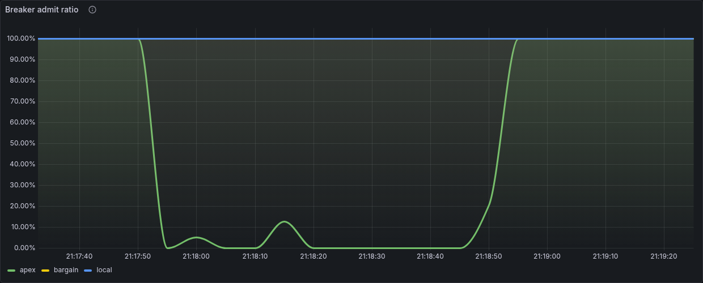

# Switchyard

[](https://github.com/bezilla/switchyard/actions/workflows/ci.yml)

An AI provider gateway that routes inference across simulated providers and
visibly survives their failures. The simulation is the point: you cannot
reproducibly break someone else's API, and reproducible failure is what makes
breaker behavior demonstrable rather than asserted.

The simulated providers are the default and stay the default. An opt-in profile
adds a real model running on your own machine, behind the same router — see
[Optional: routing to a real model](#optional-routing-to-a-real-model).

The thesis: **AI infrastructure's production problems are the old problems in
new vocabulary.** Routing, failover, rate limits, quotas, cost, observability —
the concerns CDNs and load balancers settled two decades ago, wearing different
words. Switchyard is that argument as running code.

## The result

`apex` — the fastest and most expensive of three simulated providers — taken
down hard, mid-traffic, with a load generator running:

| | |
|---|---|
| **Failovers** | 290 |
| **Requests dropped** | 0 |
| **Availability held** | 100% |
| **Error budget burned** | 0.00× |

One run of `make e2e`, which asserts these from parsed Prometheus metrics rather
than from log output. Arrival times are random, so the failover count moves by a
few either way between runs; the zero and the 100% do not.

These are the **deterministic simulated demo** — three simulated providers, the
default 10 req/s, the default 30-second request budget — and nothing on the
opt-in real-provider path changes them. They were re-established by running
`make e2e` again on the current build, after the breaker-classification fix
described in
[DESIGN.md](DESIGN.md#the-caller-giving-up-is-not-a-failure-kind-either): 0
requests dropped and 100% availability across both the break and the heal
window, with apex's rate falling to 2% of its steady state. The failover count
moves between runs, as above; those three do not. Every availability figure
elsewhere in this file names which of the two paths it came from, because they
are not interchangeable.

The provider comes back on a ramp, not a cliff. Admitted traffic climbs:

```
0.05  →  0.08  →  0.13  →  0.20  →  0.33  →  0.52  →  0.84  →  closed
```

Roughly six seconds of partial traffic before full. A textbook circuit breaker
admits one probe and then closes completely, handing a just-restarted provider
one hundred percent of the load it was failing under. That step is what causes
the second outage. The ramp is the whole point.

## What it looks like


Apex (green) goes to zero at 10:34:20. Bargain (yellow) rises to meet the same
total — the blue line across the top, which does not dip. Availability stays at
100.000%, the error budget burns at 0.00×, and apex's circuit turns red while
the other two stay green. The red-and-yellow flicker on apex is the breaker
trying recovery on its cooldown and correctly giving up, because apex is still
broken.

Nothing in that image is a mock. It is Grafana reading Prometheus, scraping the
gateway's own OpenTelemetry metrics.



*The other half of the incident: the `Breaker admit ratio` panel across one break
and recovery of `apex`, synthetic traffic at 10 req/s. The two small humps near
21:18:00 and 21:18:15 are recovery attempts that reopened — the ramp starting,
failing its ratio check and backing off — and the final climb is the one that
survived to closed. Prometheus scrapes every 5s and a full ramp finishes in about
6.3s, so a dashboard can only ever resolve a point or two inside it; the exact
ladder is in the state diagram below, read from the code.*

## Quickstart

```sh
make up
```

Builds and starts the stack detached, then prints where everything is. About ten
seconds to a serving gateway; the dashboard has a line to draw at roughly twenty
and looks like a graph by forty. (`docker compose up` works too, but it holds the
terminal, and every step below wants a prompt.)

Open <http://localhost:3000>. No login — the dashboard is the home page and
traffic is already flowing. Give it thirty seconds to fill in, then run these in
order:

> Ports 3000 and 8080 are the two most contended on a developer machine. If
> either is taken, set `GRAFANA_PORT`, `SWITCHYARD_PORT` or `PROMETHEUS_PORT`
> and the make targets will follow:
> `SWITCHYARD_PORT=8090 make up` then `make state SWITCHYARD_PORT=8090`.

```sh
make break-apex     # apex starts returning 503s
```

Watch the traffic panel: the apex band collapses, bargain rises to meet the same
total, the total does not dip. Availability holds. The **estimated spend rate**
panel *drops*, because bargain is a twelfth the price — the incident is cheaper
than the steady state. Time to first token gets worse, from ~90 ms to ~520 ms.
That is what the availability cost.

```sh
make heal-apex      # apex answers again
```

Watch **breaker admit ratio** climb through the middle before closing. That is
the ramp above, live.

`heal-apex` also switches on `-probe-early-recovery`, which lets two passing
health probes cut short a cooldown that has backed off to tens of seconds. It is
**off by default** — a probe is cheap and shallow where a real request is
neither, so a dependency can pass probes while failing traffic. The demo turns it
on so the heal happens on the timescale of someone watching;
[DESIGN.md](DESIGN.md) has the argument for why you might not want it.

### The loop: watch one request change hands

The dashboard shows failover in aggregate, which is how you watch a fleet and
not how you understand a single request. This walks one request at a time.


*A real recording, unedited: the same request before and after `make break-apex`.
`ask` is one `POST /v1/chat` printing only the `X-Switchyard-*` response headers.
Nothing changes on the client between the two calls — the provider does.*

```sh
make demo
```

It asks, reads which provider answered, breaks **that** provider, and asks
again with the same prompt — so the interesting part is not a claim in a README,
it is two headers that disagree.

By hand, it is three curls. Ask once, and read the headers:

```sh
curl -sS -D - -o /dev/null -X POST localhost:8080/v1/chat \
  -H 'content-type: application/json' \
  -d '{"prompt":"hello","max_tokens":24}' | grep -i '^x-switchyard'
```

```
X-Switchyard-Failovers: 0
X-Switchyard-Policy: failover
X-Switchyard-Provider: apex
```

`apex` answered on the first try. Now break exactly that provider:

```sh
curl -sS -X POST localhost:8080/admin/inject \
  -H 'content-type: application/json' \
  -d '{"provider":"apex","mode":"error","rate":1}'
```

```json
{"injection": {"mode": "error", "rate": 1}, "provider": "apex"}
```

Send the **identical** request again — same prompt, same flags, nothing changed
on the client:

```sh
curl -sS -D - -o /dev/null -X POST localhost:8080/v1/chat \
  -H 'content-type: application/json' \
  -d '{"prompt":"hello","max_tokens":24}' | grep -i '^x-switchyard'
```

```
X-Switchyard-Failovers: 1
X-Switchyard-Policy: failover
X-Switchyard-Provider: bargain
```

Still HTTP 200. A different provider, and a failover count that went up. The
caller never saw the 503, because the response header is written only after some
provider has accepted the request — until the first byte goes out, the gateway is
still free to change its mind. That ordering is the whole trick, and it is also
why mid-stream failover is a genuinely harder problem: see [ROADMAP.md](ROADMAP.md).

The end of the stream carries the same decision, for a client that would rather
parse the body than the headers:

```sh
curl -sS -N -X POST localhost:8080/v1/chat \
  -H 'content-type: application/json' \
  -d '{"prompt":"hello","max_tokens":24}' | tail -1
```

```
data: {"completion_tokens":24,"estimated_cost_usd":0.0000305,"failovers":1,
       "policy":"failover","prompt_tokens":2,"provider":"bargain","ttft_ms":834}
```

`make reset` puts everything back.

### The rest of the controls

```sh
make ratelimit-bargain   # a healthy provider shedding load; its breaker stays closed
make slow-apex           # 12x slower and still passing health checks
make spike-traffic       # 45 rps: find the edge of the failover capacity
make policy-cost         # route cheapest-first instead of primary-first
make state               # current routing and health state, as JSON
make ask                 # send one request and watch tokens stream
make reset               # everything back to healthy
make down
```

`make spike-traffic` combined with `make break-apex` is the honest one:
availability *falls*. Failover cannot conjure capacity the surviving providers
never had. The default load sits under that line deliberately — see
[DESIGN.md](DESIGN.md).

### Without the stack

```sh
go run ./cmd/switchyard      # gateway on :8080, traffic flowing
```

Responses stream as server-sent events, and the headers name the decision:

```
X-Switchyard-Provider: apex
X-Switchyard-Policy: failover
X-Switchyard-Failovers: 0
```

The make targets above are thin wrappers over this HTTP surface:

| endpoint | what it does |
|---|---|
| `POST /v1/chat` | streams a completion; response headers name the provider chosen |
| `POST /v1/chat/completions` | the OpenAI-compatible shape, non-streaming; same routing, same headers |
| `GET /v1/models` | the routable providers, in the shape a client library expects |
| `GET /metrics` | Prometheus exposition |
| `GET /admin/state` | routing, breaker and health state as JSON |
| `POST /admin/inject` | `{"provider":"apex","mode":"error\|ratelimit\|slow\|healthy","rate":1}` |
| `POST /admin/policy` | `{"policy":"failover\|cost"}` |
| `POST /admin/traffic` | `{"rps":45}` |
| `POST /admin/recovery` | `{"probe_early_recovery":true}` |
| `GET /healthz`, `GET /readyz` | process liveness; whether any provider can serve |

None of these are authenticated. That is deliberate for a demo and is reason
enough on its own not to expose this anywhere public.

## Optional: routing to a real model

Everything above is simulated, deliberately. This part is not.

An opt-in compose profile starts [Ollama](https://ollama.com) alongside the
stack and puts a real model in the routing table as the **primary** provider,
with the three simulated ones behind it as its failover path. No account, no
key, no spend, no network egress past the model download.

```sh
make up-ollama      # the stack, plus a local model on :11434
make ask            # one real request, answered by that model
make break-ollama   # stop it for real; watch the circuit open and traffic move
make heal-ollama    # start it again; watch the same admit ramp close it
```

`make up-ollama` is `docker compose --profile ollama up` with one variable set —
the profile decides which services exist, not what the gateway's environment
says, so the gateway still has to be told where its upstream is:

```sh
SWITCHYARD_UPSTREAMS=@/etc/switchyard/upstreams/ollama.json   docker compose --profile ollama up --build -d
```

### It is not an Ollama adapter

The adapter is generic: one OpenAI-compatible client, pointed at a base URL.
Ollama is its first consumer and gets no special case in the code. vLLM, LocalAI,
llama.cpp's server or any hosted endpoint that speaks
`POST {base}/chat/completions` and `GET {base}/models` works by copying
[`deploy/upstreams/ollama.json`](deploy/upstreams/ollama.json) and changing
`base_url` and `model`:

```json
[{ "name": "vllm", "base_url": "http://vllm:8000/v1", "model": "...", "priority": 5,
   "max_concurrent": 2, "start_timeout": "60s" }]
```

An `api_key_env` field names an environment variable to read a bearer token
from. There is deliberately nowhere to put the key itself.

### The same guarantees, or it would be decoration

A real provider is a `provider.Provider` like any other, so it gets the same
router, the same breaker and the same failure taxonomy. That claim is checked
rather than asserted: `TestRealProviderTripsTheBreakerExactlyAsASimulatedOneDoes`
runs one scenario twice — once against a simulated 503, once against a live HTTP
server that returns 200 and then never sends a token — and requires the two
observed sequences of routing outcomes to be *equal*.


*The `Circuit breaker state` panel across one break and recovery of the **real**
provider, under the opt-in profile. Three simulated providers hold green; the
fourth row is a model in a container that was stopped at 00:32:31 and started
again at 00:33:48. Red is open, yellow is recovering — the flickers are the ramp
starting, failing its ratio check and backing off. Same panel, same colors, same
semantics as the simulated three, with no dashboard change: the router does not
know which of its providers do network I/O.*

The same cycle from the command line:

```
ask                        X-Switchyard-Provider: ollama    failovers: 0    "Red"
docker compose stop ollama
ask (identical request)    X-Switchyard-Provider: apex      failovers: 1
admin/state                ollama  open        admit=0     probe=unavailable
docker compose start ollama
  t+20s                    ollama  recovering  admit=0.84
  t+40s                    ollama  closed      admit=1
```

That ramp is the geometric ladder at the top of this README — 0.05 multiplied by
1.6 per interval — caught partway up, on a provider that is actually a model on
a machine rather than a simulation of one. Availability across the whole run,
deliberate outage included, was 99.98% — that is the **opt-in real-provider
path**, not the simulated demo above. One request was lost, and it was a stream
that was mid-completion when the container was killed under it, which is the one
kind of loss the failover boundary cannot cover.

Three things are worth knowing about how the adapter earns that:

- **`Start` does not return until the first token arrives.** An upstream that
  accepts the connection, returns 200 and then thinks for forty seconds is the
  most common way real inference degrades, and it is indistinguishable from a
  healthy one until the first token. Waiting for that token inside `Start` is
  what keeps the failure reroutable — and it costs nothing, because the token is
  buffered and handed back on the first `Next`.
- **A real 429 does not open a circuit.** Same rule as the simulated case: a
  provider shedding load is working correctly.
- **`max_concurrent` matters more than anything else here.** One model on one
  machine serves one or two requests at a time. Over the cap the gateway refuses
  with a capacity error, which fails over instantly and does *not* count against
  health. With the default 10 req/s of synthetic load and a cap of 2, most
  requests are capacity-refused by `ollama` and served by `apex` — a constant
  background of failovers that is the taxonomy working, not an incident.

### What to expect on a laptop, honestly

The profile defaults to `qwen2.5:0.5b`, about 400 MB, because it is small enough
to demo without turning the page into a progress bar. It is a 0.5-billion
parameter model: it answers, and it is frequently wrong about what it answered.
That is fine here — the claim being demonstrated is *where the request went*, not
whether the completion is any good. Anything past about 3B parameters works and
is not worth watching.

Measured on an 8-core M1 laptop, both paths:

| | host `ollama serve` (Metal) | container (CPU only) |
|---|---|---|
| one short answer through the gateway | **0.63 s** | **1.4 s** |
| generation rate | ~12 ms/token | ~300 ms/token |
| model load, cold | ~10 s | ~22 s |

Three things about the container path are worth knowing before you run it:

- **The `ollama/ollama` image is about 7 GB.** It carries GPU runtimes for
  hardware you may not have. That is a real cost for an optional demo, and it is
  most of why this profile is opt-in rather than on.
- **Docker Desktop on macOS has no GPU passthrough.** `ollama ps` inside the
  container reports `100% CPU`. It works and it is roughly 25× slower per token
  than the same model on the host. On Linux the container is the fast path.
- **The model is loaded at startup, not on the first request.** The one-shot
  `ollama-pull` service pulls the weights *and* loads them into memory before the
  gateway starts, and `OLLAMA_KEEP_ALIVE` stops them being evicted while idle.
  Without that the first real request pays for a cold load: measured at over two
  minutes, which blew the 60 s start budget and was correctly recorded as a
  timeout and failed over. A true report of a model that was not ready, and a
  terrible first impression. `make up-ollama` takes about 50 seconds instead.

**Give it a request budget that fits.** `SWITCHYARD_REQUEST_TIMEOUT` bounds one
synthetic request end to end and defaults to 30 seconds, which is generous for
the simulated providers and far too short for a real model on a CPU — a
250-token answer at 300 ms per token runs past a minute. A budget under that
abandons long completions just short of success and measures the deadline
instead of the provider. `make up-ollama` sets it to 180s.

**Expect most traffic to fail over, and expect that to be correct.** With the
default 10 req/s of synthetic load and two slots, the real model is busy almost
all the time: completions run to 256 tokens, which is tens of seconds of one
slot. Everything else is capacity-refused and served by `apex` in microseconds,
availability holds at 100%, and `ollama`'s circuit stays closed throughout —
a full box is not a broken box.

That sentence was written before the breaker-classification fix and was not true
when written: measured then, availability was 99.661% and the circuit was being
pushed open by callers that had given up, not by anything the provider did.
Measured again on the current build, over 150 seconds of the same steady state:
100.000%, zero stream errors, zero trips. To watch the real model answer *your* request
rather than a synthetic one, quiet the load first:

```sh
curl -sS -X POST localhost:8080/admin/traffic   -H 'content-type: application/json' -d '{"rps":0}'
make ask
make normal-traffic
```

**On macOS, prefer the host path.** It skips the 7 GB image entirely, uses Metal,
and needs no profile — the model server just is not a compose service:

```sh
OLLAMA_HOST=0.0.0.0 ollama serve &        # on the host
ollama pull qwen2.5:0.5b
SWITCHYARD_UPSTREAMS=@/etc/switchyard/upstreams/ollama-host.json   docker compose up --build -d
```

[`deploy/upstreams/ollama-host.json`](deploy/upstreams/ollama-host.json) is the
same upstream pointed at `host.docker.internal`.

### Why the default is still simulated

Reproducible failure injection is what makes the failover claim checkable. You
cannot reproducibly break someone else's service, and there is no
`admin/inject` for a real provider — `make break-ollama` stops the container,
because that is the only honest way to break something that is actually running.
The simulated three are never removed and never downgraded.

## The OpenAI-compatible endpoint

```sh
curl -sS localhost:8080/v1/chat/completions   -H 'content-type: application/json'   -d '{"model":"default","messages":[{"role":"user","content":"hello"}],"max_tokens":60}'
```

The response is the shape a client library expects, plus the routing decision in
both the headers and the body:

```json
{ "object": "chat.completion",
  "choices": [{ "index": 0, "message": {"role": "assistant", "content": "..."},
                "finish_reason": "stop" }],
  "usage": {"prompt_tokens": 52, "completion_tokens": 60, "total_tokens": 112},
  "switchyard": {"provider": "ollama", "policy": "failover", "failovers": 0} }
```

**It does not stream, and it says so.** A request carrying `"stream": true` is
refused with a 400 that names `POST /v1/chat` — which does stream — rather than
quietly returning one object at the end. The danger of a half-compatible
endpoint is not the missing half, it is a caller that asks for something, appears
to be given it, and finds out later: a client that wanted tokens as they were
made and got a single blob has been misled about latency, about memory, and
about what the gateway's failover guarantee covered on its behalf. Streaming here
is a [v0.3 item](ROADMAP.md) that waits on the same question v0.3 has to answer.

## How it works

Three simulated providers, each making a different tradeoff, because a gateway
choosing between equivalent upstreams is not making a decision worth watching:

| provider | first token | price / Mtok | how it fails |
|---|---|---|---|
| `apex` | ~90 ms | $3 in / $15 out | rarely, and then completely |
| `bargain` | ~520 ms | $0.25 in / $1.25 out | 429s past 14 req/s |
| `local` | ~210 ms | free | refuses once its 6 slots are full |


*One request, two attempts, one header — and the point on the timeline where the
gateway stops being able to change its mind.*

Three ideas do the work:

**Failover happens before the first token.** Every way a provider can refuse is
surfaced from `Start`, before a stream exists. Until the first byte reaches the
client the gateway can silently try someone else; after that it cannot, and no
architecture changes that without abandoning streaming.

**A 429 is not ill health.** A rate-limited provider is working correctly and
shedding load. If 429s tripped its breaker, the breaker would keep traffic away,
the 429s would stop, and nothing would ever say it was safe to come back. Rate
limits and capacity refusals trigger failover without counting against health.


*The three states, the admit ladder as the code computes it, and which failure
classes are allowed to open a circuit. See [DESIGN.md](DESIGN.md#recovery-is-gradual).*

**Health probes break the breaker's circularity.** A breaker that learns only
from traffic cannot notice that a provider it is avoiding has recovered — it
stopped sending the traffic that would tell it. Probes run out of band, on every
provider, whether or not it is carrying load.

## Scope

Deliberately **not** in v0.2:

- **No custom frontend.** Grafana is the interface. No React, no bespoke UI, no
  incident-timeline view. Dashboards are checked-in JSON, provisioned from disk,
  reviewable in a diff.
- **No vendor SDKs and no paid API keys.** There is one generic OpenAI-compatible
  adapter and an opt-in profile that points it at a model running on your own
  machine — see [Optional: routing to a real model](#optional-routing-to-a-real-model).
  What is still deliberately absent is a per-vendor adapter for each hosted API,
  which would make this a project about API compatibility rather than routing.
- **No LLM analysis layer.** Nothing here asks a model to explain an incident.
- **No Kubernetes mode**, no operator, no Helm chart.
- **No trace backend in the stack.** Spans are instrumented throughout and
  export over OTLP when an endpoint is configured; the compose stack ships no
  Tempo or Jaeger, because every claim here is aggregate.
- **No auth, multi-tenancy, retry budgets, or request persistence.** The admin
  endpoints that break things are unauthenticated by design, which alone should
  keep this off anything public.

[ROADMAP.md](ROADMAP.md) covers what comes after v0.2 — streaming failover is
the headline, and retries and idempotency are the known gaps — and why each one
is a harder question than it looks.

## Limitations

- **The default providers are simulated, and simulated is not real.** No tokenizer,
  no model, no network, no bad day nobody predicted. The opt-in profile above routes
  to a real model on your own machine; everything in this list describes the
  simulated default, which is what the demo and the numbers above use. Latency distributions and failure modes are
  plausible, not measured. Real providers degrade by region, drop quality
  silently, and reset quotas at surprising boundaries.
- **Cost is estimated, not billed.** Prices are the shape and rough magnitude of
  published pricing without being any vendor's numbers, over a
  four-characters-per-token approximation no real tokenizer agrees with. The
  cost panels are right about direction and proportion and wrong about dollars.
- **This demonstrates routing behavior; it is not a production gateway.**
- **`docker compose up` is not a load test.** The default 10 req/s is sized so
  the demo is legible, not so the numbers say anything about throughput.

## Development

```sh
make init      # step 1 for any clone: installs the pre-push gate
make check     # vet, lint, race tests, identity
make e2e       # start the stack, break a provider, assert from parsed metrics
```

`make e2e` asserts on numbers that must have changed — bargain served at least N
more requests, the failover counter moved, availability stayed above its floor.
A run where the gateway silently served nothing would satisfy "no errors
occurred"; it would not satisfy that.

See [DESIGN.md](DESIGN.md) for decisions and rejected alternatives, and
[CONTRIBUTING.md](CONTRIBUTING.md) before your first commit.

## Contributing

Solo repository: changes land by direct push with CI enforced, and pull requests
are not merged here. Issues are open and welcome — bug reports, design
disagreements and questions all belong there, and a patch described in an issue
gets read and applied with credit. See [CONTRIBUTING.md](CONTRIBUTING.md).

## License

MIT. See [LICENSE](LICENSE).
